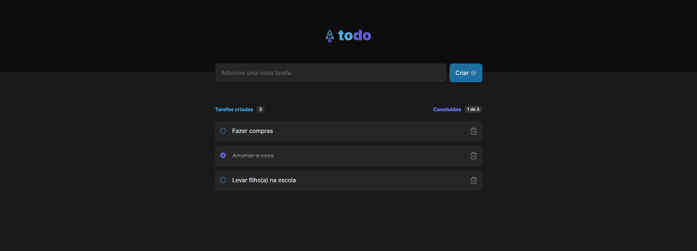

<p align="center">
  
    
</p>


<h1 align="center">
  Aplicativo de lista de tarefas (To do List)
</h1>
<p align="center">
  Desafio 1 - Aprendendo sobre os conceitos do React
</p>


## 💻 Sobre o projeto

Nesse desafio, foi proposto desenvolver uma aplicação de controle de tarefas no estilo **to-do list**, que contém as seguintes funcionalidades:

- Adicionar uma nova tarefa.
- Marcar e desmarcar uma tarefa como concluída.
- Remover uma tarefa da listagem.
- Mostrar o progresso de conclusão das tarefas.

  
## Tecnologias usadas 

- [React](https://reactjs.org/)
- [TypeScript](https://www.typescriptlang.org/)
- [Vite](https://vitejs.dev/)
- [React-Icons](https://react-icons.github.io/react-icons/)
- [Css-modules](https://github.com/css-modules/css-modules)
- [UUID](https://www.npmjs.com/package/uuid)


## :octocat: Como testar e instalar

Clonar o repositório:

```sh
git clone https://github.com/JeffersonBraga90/to-do-list.git
```

Instalar as dependências :

```sh
yarn
```

Iniciar ambiente de desenvolvimento:

```sh
yarn dev
```


## Licença

Este projeto está sob [MIT License](./LICENSE).


## Autor

Feito por [Jefferson Braga](https://www.linkedin.com/in/jeffersoncorreabraga/)